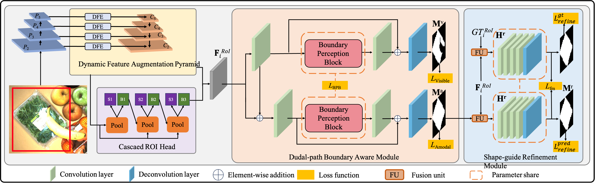

# OPNet: Deep Occlusion Perception Network with Boundary Awareness for Amodal Instance Segmentation

This is the PyTorch  implementation of OPNet built on the open-source detectron2.

"OPNet: Deep Occlusion Perception Network with Boundary Awareness for Amodal Instance Segmentation"

<table>
    <tr>
        <td><center>


## Installation

```
conda create -n opnet python=3.7 -y
source activate opnet
 
pip install torch==1.11.0+cu113 torchvision==0.12.0+cu113 -f https://download.pytorch.org/whl/torch_stable.html
 

pip install ninja yacs cython matplotlib tqdm
pip install opencv-python==4.4.0.40
pip install scikit-image
export INSTALL_DIR=$PWD
 
cd $INSTALL_DIR
git clone https://github.com/cocodataset/cocoapi.git
cd cocoapi/PythonAPI
python setup.py build_ext install
 
cd $INSTALL_DIR
git clone https://github.com/ZitengXue/OPNet.git
cd OPNet/
pip install -r requirements.txt
python3 setup.py build develop
```


## Dataset Preparation

### D2SA dataset

The D2S Amodal dataset could be found at [mvtec-d2sa](https://www.mvtec.com/company/research/datasets/mvtec-d2s/).

### KINS dataset

Download the [Images](http://www.cvlibs.net/download.php?file=data_object_image_2.zip)
from [KITTI dataset](http://www.cvlibs.net/datasets/kitti/eval_object.php?obj_benchmark=2d). 

The [Amodal Annotations](https://drive.google.com/drive/folders/1FuXz1Rrv5rrGG4n7KcQHVWKvSyr3Tkyo?usp=sharing)
could be found at [KINS dataset](https://github.com/qqlu/Amodal-Instance-Segmentation-through-KINS-Dataset)

### CWALT dataset

Follow [WALT](https://github.com/dineshreddy91/WALT)

### Expected folder structure for each dataset

```
$PROJECT_DIR/
|OPNet/
|-detectron2/
|-- data/
|---- datasets/
|------- KINS/
|---------- train_imgs/
|---------- test_imgs/
|---------- annotations/
|------------- train.json
|------------- test.json
|------- D2SA/
|-------- annotations/
|-------- images/
|------- CWALT/
|...
```

Then, See [here](detectron2/data/datasets/builtin.py) for more details on data registration

## Multi-GPU Training and evaluation on Validation set

```
cd OPNet
```

For example, on the D2SA dataset, we show how to train our method and other baselines.

1.Train our model (ResNet50 backbone) on D2SA dataset :

```
CUDA_VISIBLE_DEVICES=0,1 python tools/train_net.py --config-file configs/D2SA-AmodalSegmentation/bounday.yaml--num-gpus 2
```


## Test

If you want to eval your saved checkpoints:

```
python tools/train_net.py --config-file configs/{your_yaml_file} 
--eval-only MODEL.WEIGHTS {your_OUTPUT_DIR}/model_final.pth' --num-gpus x
```

## Acknowledgement

Our work benefits a lot from [BCNet](https://github.com/lkeab/BCNet) and [VRSP-Net](https://github.com/YutingXiao/Amodal-Segmentation-Based-on-Visible-Region-Segmentation-and-Shape-Prior). Thanks for their wonderful works.
