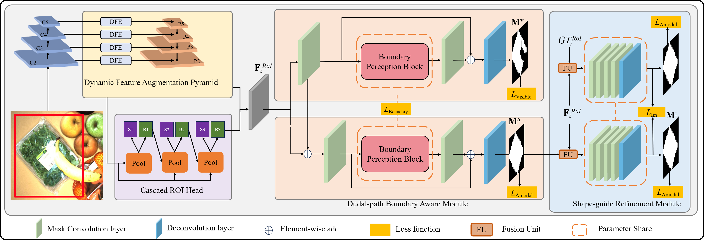

# OPNet: Deep Occlusion Perception Network with Boundary Awareness for Amodal Instance Segmentation

This is the PyTorch  implementation of OPNet built on the open-source detectron2.

"OPNet: Deep Occlusion Perception Network with Boundary Awareness for Amodal Instance Segmentation"

<table>
    <tr>
        <td>

